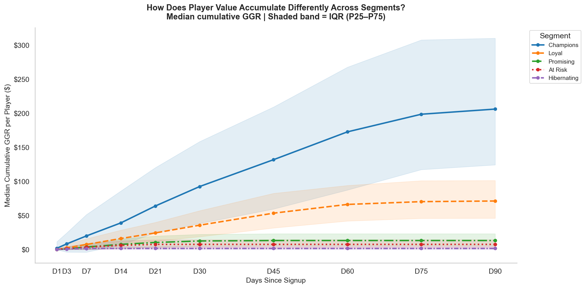
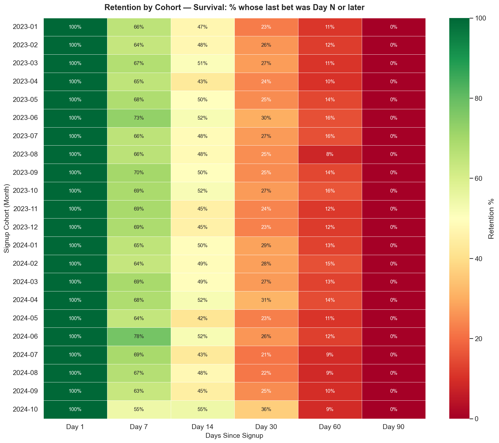
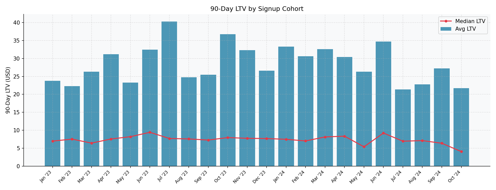
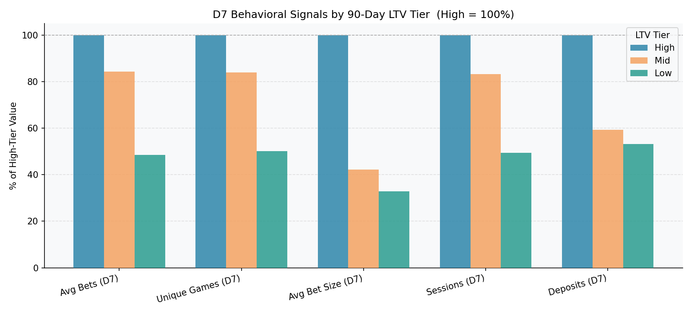
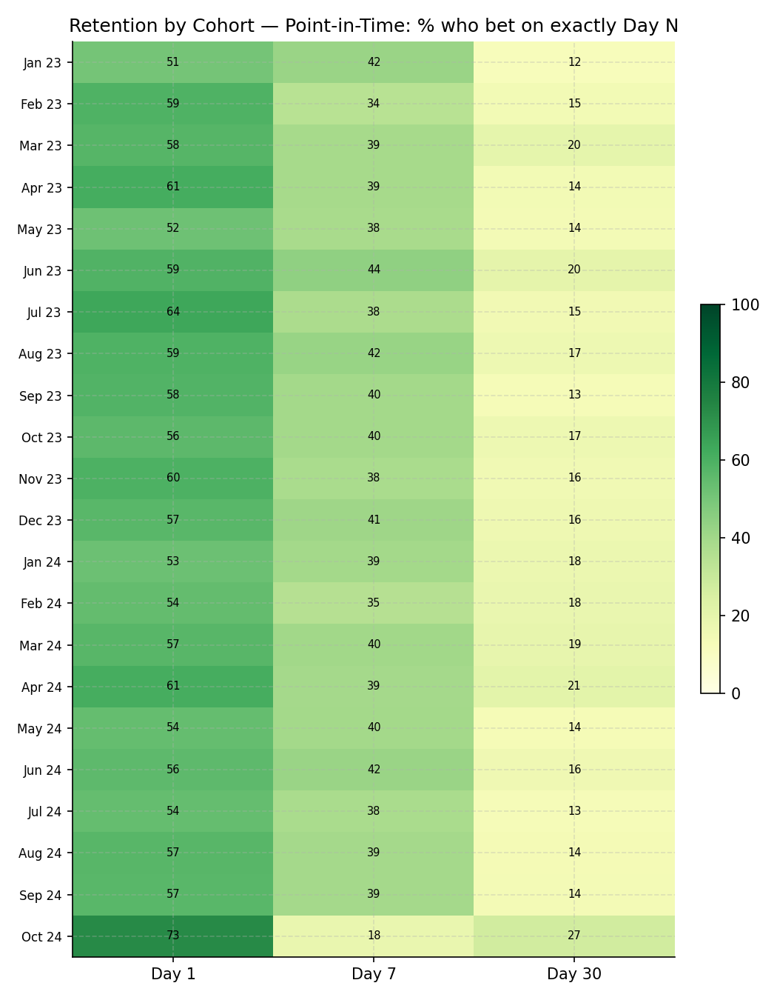
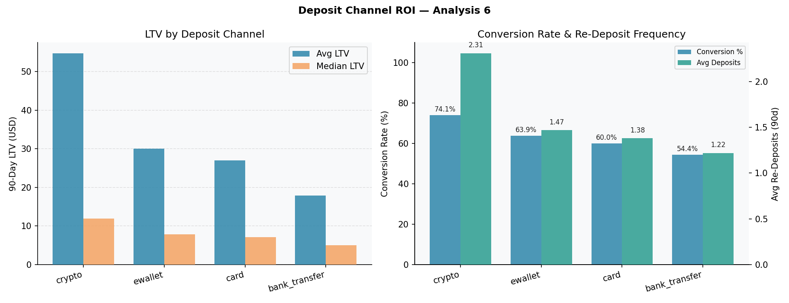
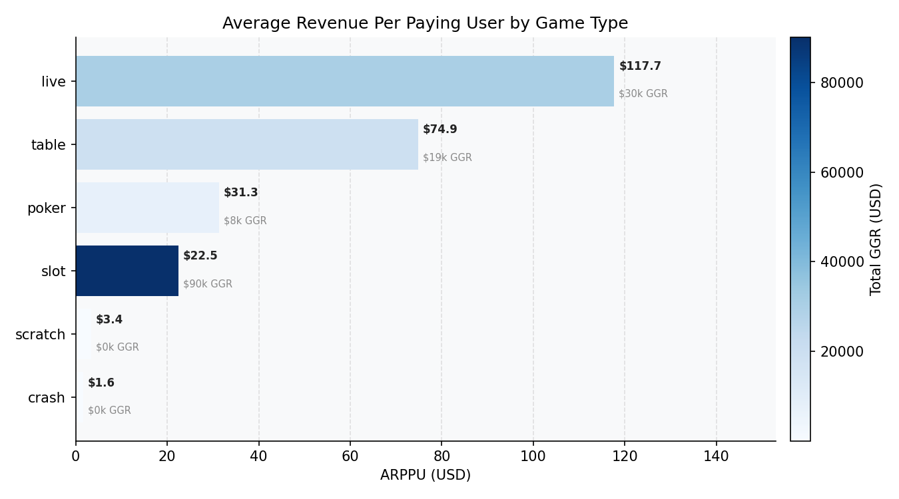
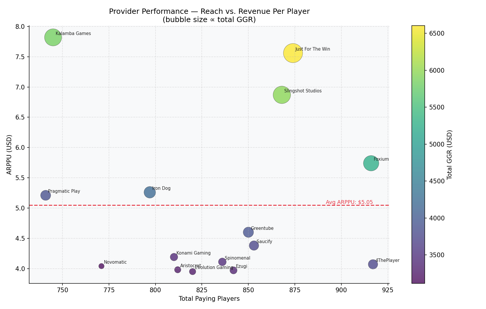
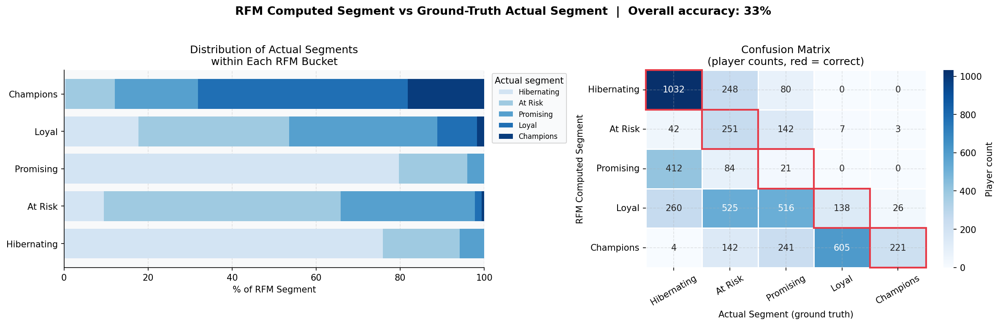

# Player Lifetime Value Engine | iGaming Analytics

End-to-end analysis of 5,000 casino players identifying the acquisition channels, D7 behavioral signals, and retention levers that drive 90-day GGR.

## Business Problem

LuckyEdge Casino's customer acquisition cost rose 34% QoQ while 90-day LTV remained flat. Of 5,000 registered players generating $144,636 in total 90-day GGR, the distribution of value is so skewed that blended LTV metrics hide the real opportunity: most revenue comes from a small, identifiable segment that behaves differently from day one.

## Key Findings

**1. Revenue is hyper-concentrated.** The top 20% of players (1,000 of 5,000) generated 81.1% of total 90-day GGR — $117,260 of $144,636. The bottom 50% contributed less than 2% ($1.16 avg LTV).

**2. Retention collapses in the D7–D30 window.** Average retention falls from 57.0% (D1) → 39.4% (D7) → 15.9% (D30) across 21 cohorts. The D7–D30 window accounts for ~60% of all churn — the highest-leverage intervention zone.

**3. High-LTV players are identifiable by Day 7.** High-LTV players average 3.0× the bet size of Low-LTV players within the first week ($1.28 vs $0.42) and place 2.1× more bets (193.5 vs 93.8). Bet size is the sharpest early discriminator and is observable before the D7–D30 churn wave.

**4. Crypto channel delivers 2.4× the LTV of bank transfer.** Crypto-channel players represent 10% of the base but generate 19% of total GGR ($27,495), with a median 90-day LTV of $11.94 vs $5.03 for bank transfer and the highest conversion rate in the dataset (74.1% vs 54.4%).

## Recommendation

Shift marginal acquisition budget to the crypto channel and deploy a D7 bet-size trigger. Crypto players are 10% of the base but generate 19% of GGR at a median LTV of $11.94 — **2.4× higher than bank-transfer players ($5.03)**. Flagging players with avg bet <$0.50 and <100 bets at day 7 for a targeted re-engagement offer is projected to drive incremental 90-day GGR via mid-tier conversion uplift.

## Stack

SQL (DuckDB) · Python (pandas, seaborn, plotly) · Interactive HTML Dashboard

---

## Live Dashboard

**[Open dashboard.html →](docs/dashboard.html)**

Interactive Plotly dashboard with segment and cohort-year slicers. Open the file locally in any browser — no server required.

---

## Project Structure

```
README.md              — this file
EXECUTIVE_SUMMARY.md   — business-facing findings memo
requirements.txt       — Python dependencies

run_analysis.py        — ingest data → run all SQL queries → export CSVs to sql/results/
regen_charts.py        — regenerate static chart PNGs from result CSVs
build_dashboard.py     — build the interactive HTML dashboard

data/raw/              — original source CSVs (players, transactions, game metadata)
data/processed/        — cleaned data (players_clean.csv, transactions_clean.parquet)

docs/dashboard.html    — interactive dashboard (main deliverable)
docs/figures/          — static chart exports (chart_01 – chart_07, ltv_curves, retention_heatmap)

notebooks/             — EDA, data cleaning, and LTV segmentation notebooks
sql/schema.sql         — DuckDB schema definition
sql/queries/           — modular SQL analysis scripts (6 queries)
sql/results/           — CSV outputs from each query
```

## Dataset

5,000 synthetic casino players with ~2.2M transactions across 22 cohort months (January 2023 – October 2024). Game metadata (titles, providers, RTP, volatility) sourced from the [Online Casino Games Dataset v2](https://www.kaggle.com/datasets/willianoliveiragibin/casino-gaming-data) on Kaggle (CC0 license).

## How to Run

```bash
git clone https://github.com/DanilaKhryshchanovych/player-ltv-engine.git
cd player-ltv-engine
pip install -r requirements.txt
python run_analysis.py    # ingest data, run all SQL queries, write CSVs to sql/results/
python regen_charts.py    # regenerate all PNGs from CSVs into docs/figures/
python build_dashboard.py # rebuild the interactive HTML dashboard
```

---

## Results Preview

<table>
<tr>
<td width="50%">

**LTV Curves by Segment** — Champions compound to $117 median 90d GGR; Hibernating players plateau below $5. The gap is visible by D7, enabling early segmentation.


</td>
<td width="50%">

**D1 → D30 Retention Heatmap** — Average D30 retention: 15.9%. Best cohort (Apr 2024): 20.85%. The D7–D30 window accounts for ~60% of all churn.


</td>
</tr>
<tr>
<td width="50%">

**GGR by Game Type** — Revenue concentration by game category. Informs where to focus bonus budget and game-mix decisions.


</td>
<td width="50%">

**Churn Velocity by Segment** — Champions retain at D30 at 2× the rate of At-Risk players. D7 bet-size is the earliest observable predictor of final segment.


</td>
</tr>
<tr>
<td width="50%">

**Cohort Engagement by Checkpoint** — Day-1 contact rate averages 57.7%, falling to 38.4% at Day 7 and 16.5% at Day 30. Cohort-level consistency confirms churn is structural, not seasonal.


</td>
<td width="50%">

**Deposit Channel ROI** — Crypto players convert at 74.1% and generate 3× the average LTV of bank-transfer players ($54.77 vs $17.88). Reallocating acquisition spend toward crypto is the highest-confidence ROI lever.


</td>
</tr>
<tr>
<td width="50%">

**ARPPU by Game Type** — Live tables generate $117.67 per paying user — 5× higher than slots ($22.48) — but reach only 258 players vs 4,010. The small-but-high-value live segment is the clearest per-seat monetisation opportunity.


</td>
<td width="50%">

**Provider Performance: Reach vs ARPPU** — Bubble size encodes total GGR; median lines divide four quadrants. Upper-right providers combine broad reach with high revenue per player and warrant preferred integration.


</td>
</tr>
<tr>
<td colspan="2">

**RFM Segmentation vs CRM Ground Truth** — Computed RFM labels match "At Risk" players exactly. High-scoring RFM Champions scatter across CRM tiers, revealing where score thresholds diverge from behavioural reality.


</td>
</tr>
</table>

> Full 9-chart analysis and interactive drill-down in [docs/dashboard.html](docs/dashboard.html).
